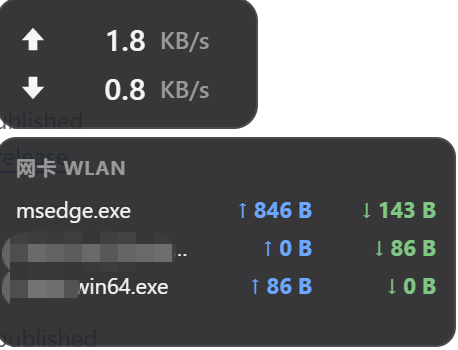

# trafmon

> [中文](./README.md) · **English**

A tiny, frameless, always-on-top floating widget for Windows that shows live
network speed at a glance — built with **Rust + Tauri v2**.

```
 ↑  193.9 KB/s
 ↓  199.5 KB/s
```



## Download

Grab the latest from [Releases](https://github.com/Schweik7/trafmon/releases/latest), or pick directly:

| Installer | Notes |
| --- | --- |
| [trafmon_0.2.0_x64_en-US.msi](https://github.com/Schweik7/trafmon/releases/download/v0.2.0/trafmon_0.2.0_x64_en-US.msi) | MSI installer (x64) |
| [trafmon_0.2.0_x64-setup.exe](https://github.com/Schweik7/trafmon/releases/download/v0.2.0/trafmon_0.2.0_x64-setup.exe) | NSIS installer (x64) |

> 64-bit Windows 10 / 11 only. Run as Administrator to see per-process speeds (see below).

## Features

- **Compact two-line display** — upload (↑) and download (↓) speed, refreshed
  every second. Units auto-switch (KB/s → MB/s → GB/s) to stay ~4 digits, with
  the values right-aligned and units vertically aligned.
- **Per-process network speed on hover** — a native tooltip lists the top
  bandwidth-consuming processes with per-process ↑/↓ rates. *(Requires running
  as Administrator — see below.)*
- **Network-card selection** — defaults to the Wi-Fi adapter; switch via the
  tray menu or middle-click.
- **Day / Night themes** — toggle by right-click or the tray menu; persisted.
- **System tray menu** — show/hide the widget, pick the network card, set
  window opacity, switch theme, and quit.
- **Frameless, translucent, draggable** — drag from anywhere, stays on top,
  hidden from the taskbar.

## Interactions

| Action | Result |
| --- | --- |
| Left-drag anywhere | Move the widget |
| Hover | Native tooltip with per-process network speed |
| Right-click | Toggle day / night theme |
| Middle-click | Cycle to the next network interface |
| Tray left-click | Show the widget |
| Tray right-click | Menu: show/hide · network card · opacity · theme · about · quit |

## Administrator requirement

Per-process network throughput is collected via **ETW**
(`Microsoft-Windows-Kernel-Network`). Starting a real-time ETW session requires
Administrator privileges. Behaviour:

- **Run normally** — the two-line total speed works fine; the hover tooltip
  shows a hint that admin is required.
- **Run as Administrator** — the tooltip lists per-process ↑/↓ speeds.

## Tech stack

- **Tauri v2** — frameless transparent window, system tray, IPC.
- **[`sysinfo`](https://crates.io/crates/sysinfo)** — per-interface throughput
  and PID → process-name mapping.
- **[`ferrisetw`](https://crates.io/crates/ferrisetw)** — safe ETW consumer for
  per-process network bytes.
- Vanilla HTML/CSS/JS frontend (no framework, no bundler).

## Development

Prerequisites: [Rust](https://rustup.rs), [Node.js](https://nodejs.org) with
[pnpm](https://pnpm.io), and the Tauri CLI:

```bash
cargo install tauri-cli --version "^2"
```

Run in dev mode:

```bash
pnpm install
pnpm dev          # = cargo tauri dev
```

Run the Rust unit tests:

```bash
cd src-tauri && cargo test
```

## Build

```bash
pnpm build        # = cargo tauri build
```

The installer / executable is produced under
`src-tauri/target/release/bundle/`. To enable per-process network speeds, launch
the built executable as Administrator.

## Project layout

```
src/                 frontend (index.html, style.css, main.js)
src-tauri/
  src/lib.rs         Tauri commands + system tray
  src/monitor.rs     interface throughput, NIC selection, per-process rates
  src/netproc.rs     ETW per-process network collector
  tauri.conf.json    window config (frameless, transparent, always-on-top)
```
